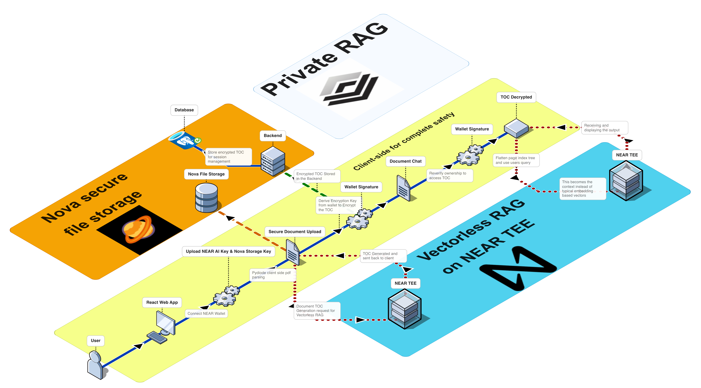

<h1 align="center">PrivateRAG</h1>

<p align="center">
  
</p>

<h2 align="center"><strong>Vectorless, reasoning-based RAG with end-to-end encryption.</strong><br> Your documents. Your keys.</h2>

## Table of Contents

- [Architecture Diagram](#architecture-diagram)
- [The Problem](#the-problem)
- [Our solution](#our-solution)
- [What gets on the server side?](#what-gets-on-the-server-side)
- [Two Signatures and the Cryptographic Process](#two-signatures-and-the-cryptographic-process)
  - [1. Key-derivation signature](#1-key-derivation-signature)
  - [2. TOC ownership signature](#2-toc-ownership-signature)
  - [Cryptographic process (high level)](#cryptographic-process-high-level)
- [Deployment](#deployment)
- [Team Members](#team-members)
- [License](#license)

# Architecture Diagram



## The Problem

Traditional RAG systems rely on **vectorization**: documents are split into chunks, turned into embeddings, and stored in vector databases. That implies:

- **Chunking** destroys context, tables, and cross-references.
- **Vectorization** means your text is sent to an embedding API and stored (often in plaintext or as vectors) in third-party infrastructure. You lose control and privacy.
- **Similarity search** is not semantic truth - retrieved chunks can mislead the model.

PrivateRAG avoids vectors entirely. We use a hierarchical table of contents (PageIndex-style) and keep encryption in your hands.


## Our solution

Aligned with the in-app docs `/docs`:

1. **Client-side PDF processing**  
   Your PDF never leaves the device. Text is extracted in the browser with **Pyodide** (Python in WebAssembly) and **pypdf**. Only extracted text is used for the next step.

2. **NEAR AI Trusted Execution Environment (TEE)**  
   To build a rich **PageIndex** (hierarchical TOC), only the extracted text is sent to **NEAR AI** (`cloud-api.near.ai`). Processing runs inside a **Trusted Execution Environment** - confidential computing so the operator cannot see your data. You use your own NEAR AI API key (e.g. stored in the browser); the backend does not proxy your PDF or key.

3. **Vectorless RAG**  
   We follow a **vectorless** approach inspired by [PageIndex](https://github.com/VectifyAI/PageIndex) ([vectorless RAG cookbook](https://docs.pageindex.ai/cookbook/vectorless-rag-pageindex)): no embeddings, no vector DB. A **TypeScript implementation** of the PageIndex logic runs in the frontend and talks to NEAR AI’s TEE so structure extraction stays client-side.

4. **Encryption and storage**  
   The resulting TOC is encrypted in the browser with **AES-256-GCM** using a key derived from your wallet. Only the **encrypted blob** is sent to the server and stored in the **vaults** table. The server cannot decrypt it.

5. **Decryption**  
   The client fetches the vault by `owner_wallet` and `doc_hash`, re-derives the decryption key from your key-derivation signature, and decrypts `encrypted_toc` with AES-256-GCM (IV and auth tag are in the blob). **What the hash and signature do:** `doc_hash` identifies which document the vault belongs to. `toc_signature` is the wallet signature of that hash; the client verifies (ECDSA recovery) that the signer equals `owner_wallet` before decrypting, so you know the vault was created by that wallet for that document and the blob was not swapped.
 

## What gets on the server side?

The server stores **only** what is needed to persist and list your encrypted TOC in a table whose schema is as follows:

| Column         | Type        | Description |
|----------------|-------------|-------------|
| id             | INTEGER PK  | Auto-increment primary key |
| owner_wallet   | VARCHAR(255)| Wallet address that owns this vault (lowercase) |
| doc_hash       | VARCHAR(64) | SHA-256 of the original PDF (unique per document) |
| title          | VARCHAR(255)| Document title (e.g. filename) |
| num_pages      | INTEGER     | Page count (optional) |
| encrypted_toc  | TEXT        | AES-256-GCM encrypted TOC blob. Server cannot decrypt. |
| toc_signature  | VARCHAR(200)| Wallet signature of `doc_hash` (ownership proof) |
| created_at     | TIMESTAMP   | Creation time |
| updated_at     | TIMESTAMP   | Last update time |

**Unique constraint:** `(owner_wallet, doc_hash)` - one vault per document per wallet.

The server never sees the raw PDF, the decrypted TOC, or your encryption key.


## Two Signatures and the Cryptographic Process

We use **two** wallet signatures with different roles.

### 1. Key-derivation signature

- **What:** You sign a **fixed message** (e.g. a deterministic string) with your wallet.
- **Used for:** Deriving the **encryption key** (e.g. SHA-256 of the signature or of a key-derivation payload). Same wallet + same message ⇒ same key every time.
- **Stored:** No. The key is derived on demand in the browser and never sent or stored. It is used only to encrypt before upload and decrypt after fetch.

So: this signature is the **secret material** that gives you the only key that can decrypt your vault. Without it, the server cannot decrypt `encrypted_toc`.

### 2. TOC ownership signature

- **What:** You sign the **document hash** (`doc_hash`) - e.g. `"PrivateRAG-TOC-Ownership:{doc_hash}"` - with your wallet.
- **Used for:** **Proof of ownership.** Anyone can verify that the signer of this message is the wallet that claims to own the vault.
- **Stored:** Yes. Stored as `toc_signature` next to the vault. It does not reveal the TOC contents; it only attests “this wallet created this vault for this doc_hash.”

So: the first signature is for **confidentiality** (key derivation); the second is for **attestation** (ownership and integrity of the binding to the document).

### Cryptographic process (high level)

- **Encryption (client):**  
  Key = f(wallet key-derivation signature). Encrypt TOC with **AES-256-GCM**; store IV and auth tag with the ciphertext in the `encrypted_toc` payload. Send encrypted blob + metadata (including `toc_signature`) to the server.

- **Decryption (client):**  
  Fetch vault; verify ownership (recover signer from `toc_signature` and check it equals `owner_wallet`). Re-derive the key from the key-derivation signature; decrypt `encrypted_toc` with AES-256-GCM (IV and tag in blob). GCM tag verifies integrity. The hash and signature ensure you are decrypting the right vault and that it was created by the claimed wallet.

The server only persists and returns opaque blobs and metadata; it never has the key or the plaintext TOC.

## Installation & Setup Guide

### 1. Ensure PostgreSQL is Installed and Running

Make sure PostgreSQL is running and your `.env` is configured, as specified in the backend's `.env.example`.

### 2. Install backend dependencies

```bash
cd backend
pip install -r requirements.txt
```

### 3. Run Database Migrations

Activate the backend environment and run:

```bash
alembic upgrade head
```

### 4. Run the Backend

```bash
uvicorn main:app --reload --host 0.0.0.0 --port 8000
```

### 5. Deploy the Frontend

```bash
cd frontend
npm install
npm run dev
```

## Deployment

- **Frontend**: https://private-rag.vercel.app/app
- **Backend**: https://privaterag.onrender.com/


## Team Members

- <a href="https://github.com/suyash101101/" target="_blank">Suyash D Nahar</a>
- <a href="https://github.com/vg239/" target="_blank">Vatsal Gandhi</a>
- <a href="http://github.com/nikhilKottoli/" target="_blank">Nikkhil Kottoli</a>


## License

MIT. See [LICENSE](LICENSE).

Credits to [Vectify AI](https://github.com/VectifyAI) for [PageIndex](https://github.com/VectifyAI/PageIndex).
