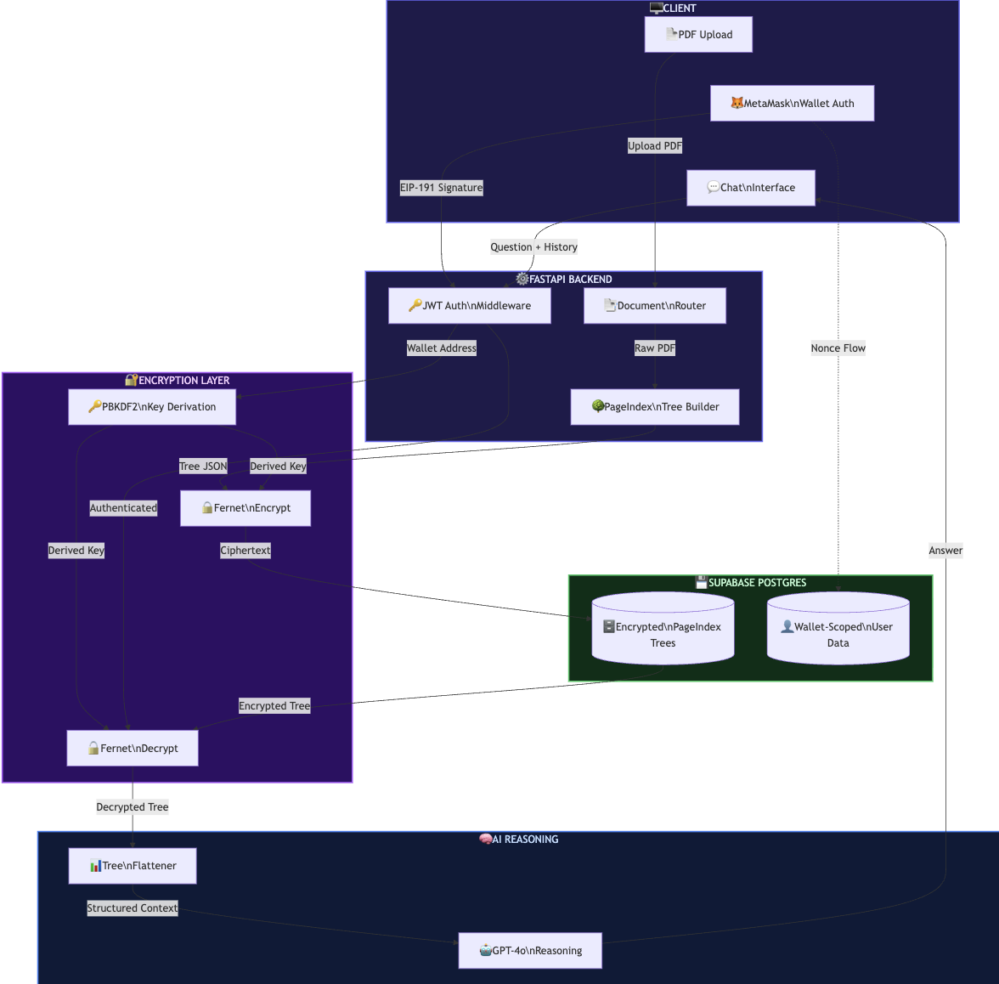
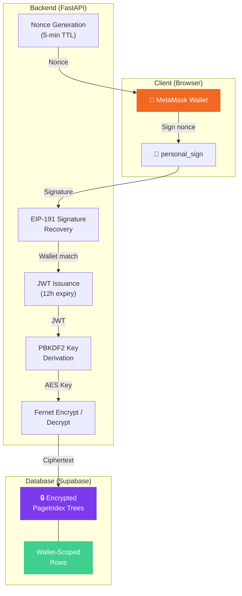

<p align="center">
  
</p>

<h1 align="center">🔐 PrivateRAG</h1>

<p align="center">
  <b>Vectorless, Reasoning-Based RAG with End-to-End Encryption</b><br/>
  <i>Your documents. Your keys. Your intelligence.</i>
</p>

<p align="center">
  
  
  
  
  
  
  
  
</p>

---

## 🚨 The Problem

Traditional RAG systems suffer from three critical flaws:

| Pain Point | What Happens |
|---|---|
| 🧩 **Chunking Chaos** | Documents are blindly split into fixed-size chunks, destroying context, tables, and cross-references |
| 🔓 **Zero Privacy** | Sensitive documents are vectorized and stored in plaintext across third-party vector databases |
| 🎯 **Hallucination Risk** | Embedding similarity ≠ semantic relevance — retrieved chunks often mislead the LLM |

> **What if your RAG system could _reason_ over your documents like a human researcher —
> while keeping your data encrypted end-to-end with keys only _you_ control?**

---

## 💡 Our Solution

**PrivateRAG** is a radically different take on document intelligence that replaces the entire vector pipeline with **[PageIndex](https://github.com/VectifyAI/PageIndex)** — a hierarchical, LLM-generated table of contents that preserves a document's logical structure.

```
┌──────────────────────────────────────────────────────────┐
│  Traditional RAG          vs.       PrivateRAG           │
│                                                          │
│  PDF → Chunks → Embeddings     PDF → PageIndex Tree      │
│      → Vector DB Search             → LLM Reasoning      │
│      → Prompt + Retrieved            → Structured Q&A    │
│                                                          │
│  ❌ Context lost               ✅ Structure preserved    │
│  ❌ Plaintext vectors          ✅ E2E encrypted          │
│  ❌ Similarity guessing        ✅ Logical reasoning      │
└──────────────────────────────────────────────────────────┘
```

### ⚡ How It Works



---

## ✨ Key Features

### 🌳 Vectorless RAG with PageIndex
> No vector database. No embeddings. No chunking.

Instead of slicing documents into chunks and embedding them, PrivateRAG uses the open-source **PageIndex** library to generate a **hierarchical tree** that captures the document's logical structure — sections, subsections, page ranges, and summaries. The LLM then _reasons_ over this tree to find relevant sections before answering.

### 🔐 End-to-End Encryption (E2EE)
> Your wallet = your encryption key. Not even the server can read your data.

Every document's PageIndex tree is encrypted using **Fernet symmetric encryption** with keys derived via **PBKDF2-HMAC-SHA256** from your Ethereum wallet address. The server stores only ciphertext — decryption happens only when _you_ authenticate.

```
Wallet Address → PBKDF2(100k iterations) → Fernet Key → AES-128-CBC
                    ↑
              Server-side salt
              (SHA256 of secret)
```

### 🦊 Web3 Wallet Authentication
> Sign in with MetaMask. No passwords. No emails. Cryptographic identity.

Authentication uses the **EIP-191** nonce-signature flow:
1. Server generates a random nonce (5-min TTL)
2. User signs the nonce with MetaMask (`personal_sign`)
3. Server recovers the signer address via `eth_account`
4. JWT issued on match → all subsequent requests are wallet-scoped

### 🧠 Multi-Turn Conversational Chat
> Ask follow-up questions. The AI remembers context.

The chat endpoint supports full conversation history, enabling multi-turn dialogue over your documents. GPT-4o receives the PageIndex tree as structured context and synthesizes answers from relevant sections.

### 📄 Instant PDF Indexing
> Upload a PDF → Get a fully indexed, queryable document in seconds.

PDFs are processed in-process using the PageIndex library with configurable parameters (max pages per node, TOC detection, summaries). Status tracking (`pending` → `indexing` → `ready` / `failed`) provides real-time feedback.

### 👤 Owner-Scoped Access Control
> Every document is tied to a wallet. No one else can see or query your files.

All document operations (`list`, `get`, `chat`) are scoped to the authenticated wallet address. Documents are filtered at the database level — not just the application layer.

---

## 🏗️ Architecture

```
privateRAG/
├── backend/                    # FastAPI + Python
│   ├── main.py                 # App entry, CORS, lifespan
│   ├── config.py               # Environment configuration
│   ├── models.py               # SQLModel (User + Document)
│   ├── schemas.py              # Pydantic request/response contracts
│   ├── encryption_utils.py     # 🔐 Fernet E2EE (wallet-derived keys)
│   ├── auth_utils.py           # JWT middleware
│   ├── openai_client.py        # 🧠 GPT-4o chat over PageIndex trees
│   ├── pageindex_service.py    # 🌳 PDF → PageIndex tree generation
│   ├── routers/
│   │   ├── auth.py             # 🦊 MetaMask nonce/verify flow
│   │   ├── documents.py        # 📄 Upload, list, get documents
│   │   ├── chat.py             # 💬 Multi-turn Q&A
│   │   └── users.py            # 👤 User CRUD
│   ├── database/
│   │   ├── connection.py       # Supabase client
│   │   └── repositories/       # Data access layer
│   ├── PageIndex/              # 📦 Open-source PageIndex library
│   └── alembic/                # Database migrations
│
└── frontend/                   # React 19 + TypeScript + Vite
    └── src/
        ├── App.tsx             # Main app with wallet connect
        ├── api/client.ts       # API client + auth token management
        └── components/
            ├── UploadArea.tsx   # Drag & drop PDF upload
            ├── DocumentList.tsx # Sidebar document listing
            ├── TreeView.tsx     # 🌳 Interactive PageIndex tree viewer
            └── ChatPanel.tsx    # 💬 Real-time chat interface
```

---

## 🔒 Security Model



| Layer | Mechanism | Detail |
|-------|-----------|--------|
| **Authentication** | EIP-191 + JWT | Cryptographic wallet signatures, 12h token expiry |
| **Encryption** | Fernet (AES-128-CBC) | PBKDF2-HMAC-SHA256, 100k iterations, server-salted |
| **Access Control** | Wallet-scoped queries | DB-level row filtering by `owner_wallet` |
| **Transport** | HTTPS + Bearer tokens | Standard TLS + JWT authorization headers |

---

## 🚀 Quick Start

### Prerequisites

- Python 3.11+
- Node.js 18+
- [Supabase](https://supabase.com) project (free tier works)
- [OpenAI API key](https://platform.openai.com)
- [MetaMask](https://metamask.io) browser extension

### 1️⃣ Clone the Repository

```bash
git clone https://github.com/your-org/privateRAG.git
cd privateRAG
```

### 2️⃣ Backend Setup

```bash
cd backend
python -m venv .venv && source .venv/bin/activate
pip install -r requirements.txt
```

Create a `.env` file:

```env
SUPABASE_URL=https://your-project.supabase.co
SUPABASE_KEY=your-anon-key
OPENAI_API_KEY=sk-...
OPENAI_MODEL=gpt-4o-mini-search-preview-2025-03-11

# Optional tuning
DOCS_STORAGE_PATH=storage/documents
DEBUG=false
```

Apply migrations and start the server:

```bash
alembic upgrade head
uvicorn main:app --reload
```

> 📍 API available at `http://localhost:8000` · Swagger docs at `/docs`

### 3️⃣ Frontend Setup

```bash
cd frontend
npm install
npm run dev
```

> 📍 Frontend available at `http://localhost:5173`

### 4️⃣ Connect & Use

1. Click **"Connect Wallet"** → MetaMask popup → Sign the nonce
2. **Upload a PDF** → Watch it get indexed in real-time
3. **Ask questions** → Get structured, citation-aware answers
4. **Follow up** → The AI remembers your conversation context

---

## 🔌 API Reference

| Method | Endpoint | Description | Auth |
|--------|----------|-------------|------|
| `POST` | `/auth/nonce` | Request a login nonce for a wallet | ❌ |
| `POST` | `/auth/verify` | Verify signature and get JWT | ❌ |
| `POST` | `/documents` | Upload & index a PDF | 🔑 |
| `GET` | `/documents` | List your documents | 🔑 |
| `GET` | `/documents/{id}` | Get document + PageIndex tree | 🔑 |
| `POST` | `/chat` | Ask a question about a document | 🔑 |
| `GET` | `/health` | Health check | ❌ |

> 🔑 = Requires `Authorization: Bearer <jwt>` header

---

## ⚙️ Configuration

| Variable | Default | Description |
|----------|---------|-------------|
| `SUPABASE_URL` | — | Your Supabase project URL |
| `SUPABASE_KEY` | — | Supabase anon/service key |
| `OPENAI_API_KEY` | — | OpenAI API key |
| `OPENAI_MODEL` | `gpt-4o-mini-search-preview-2025-03-11` | LLM model for chat + indexing |
| `DOCS_STORAGE_PATH` | `storage/documents` | Where uploaded PDFs are saved |
| `PAGEINDEX_TOC_CHECK_PAGES` | `20` | Pages to scan for table of contents |
| `PAGEINDEX_MAX_PAGES_PER_NODE` | `10` | Max pages per tree node |
| `PAGEINDEX_MAX_TOKENS_PER_NODE` | `20000` | Max tokens per tree node |
| `DEBUG` | `false` | Enable debug logging |

---

## 📜 License

This project is licensed under the **MIT License** — see the [LICENSE](license) file for details.
<p align="center">
  <p>Credits to <a href="https://github.com/VectifyAI">Vectify AI</a> for creating and maintaining PageIndex</p>
</p>
